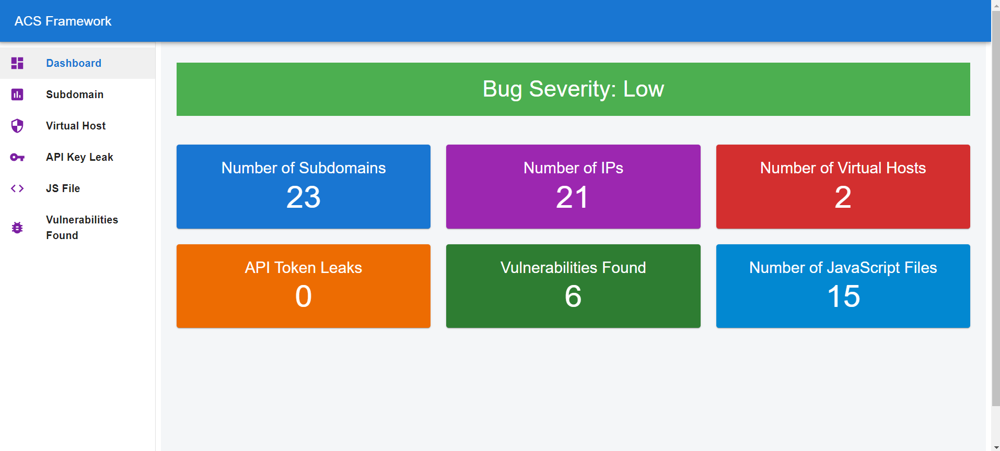

# Project Name

## Installation

### To run this project locally, follow these steps:
1. To install project dependencies, run `npm install`.
2. Install `react-router-dom` with `npm install react-router-dom`.
3. Install `mui` with `npm install @mui/material @emotion/react @emotion/styled @mui/icons-material`
4. Run with `npm run dev`

